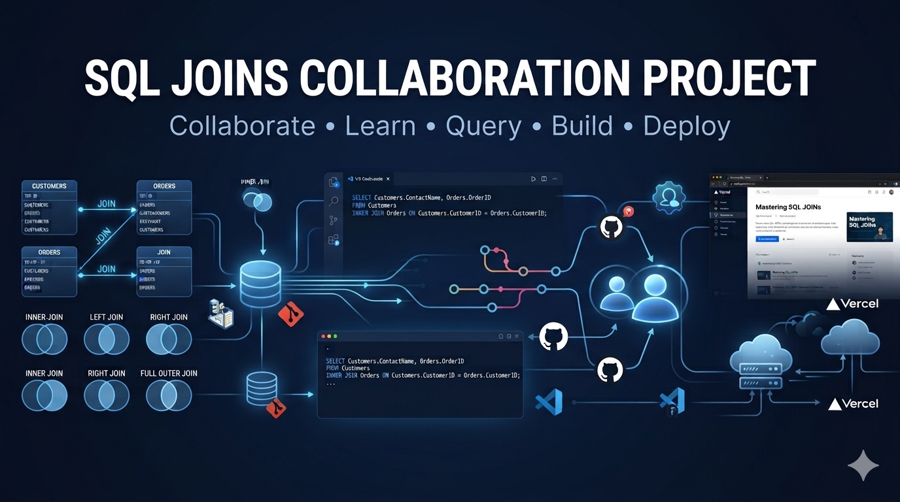

  

### Project Overview 📌

This is a collaborative project created to help us better understand SQL JOINs through practical examples.

We used SSMS to practice and test our SQL queries, Git Bash and GitHub to work together and manage our changes, and VS Code to build a simple learning website explaining JOINs.

The website was then deployed using Vercel.

### JOINs Covered 🧩

* INNER JOIN
* LEFT JOIN
* RIGHT JOIN
* FULL OUTER JOIN

### Tools Used 🛠️

### Contributors 👥

- **Kego Mashego** 
- **Rofhiwa Muthivhi**

### Live Website 🌐

[**View the SQL JOINs Learning Website →**](YOUR-VERCEL-LINK-HERE)

---

### What We Practiced 💡

**SQL - Git & GitHub - VS Code - Website Development - Vercel Deployment**

This project gave us an opportunity to learn SQL JOINs while also getting practical experience working together on a shared GitHub project.

